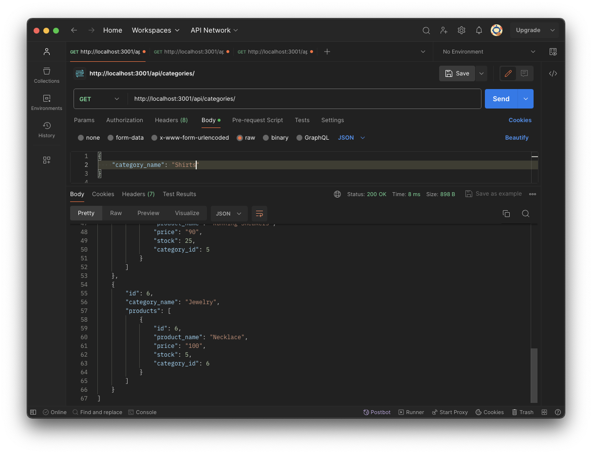
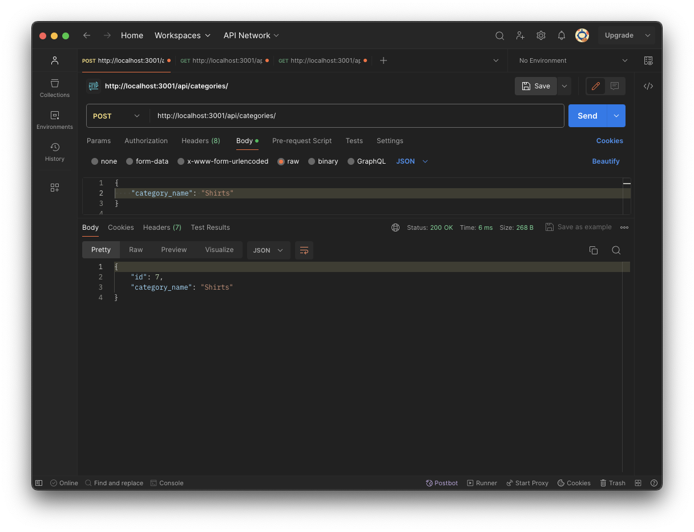

# E-Commerce Backend

## Description

The purpose of this project is to build the back end for an e-commerce site. This involved taking a working Express.js API and configuring it to use Sequelize to interact with a MySQL database, using GET, POST, PUT, and DELETE routes.

## Installation

A video showing the functionality of this project can be found here: https://drive.google.com/file/d/1WCXQ817S-Uvpw3piPc5fSmhJxnaxlUGd/view

## Usage

The application allows data to be returned from a GET route as shown:

The application also allows data to be updated through the API as shown:

## Credits

N/A

## License

Copyright (c) 2023 Joe Preimesberger

Licensed under the MIT license.